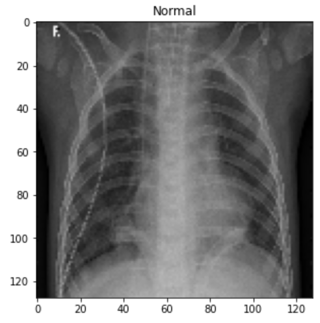

# Chest X-Ray Analysis

**Author**: [Michael Tsypin](email:mtsypin9@yahoo.com)

## Overview

The main goal of this project is to create a model that can predict whether a patient has pneumonia or not based on a chest x-ray image. Using various image classification techniques, we will analyze chest x-ray images of pediatric patients from the Guangzhou Women and Children's Medical Center. Using this dataset, we will iterate through multiple models to determine which is the most accurate.

## Business Problem

A hospital wants to reduce the amount of time spent reviewing chest x-ray images. We need to create a model that is able to read and analyze chest x-ray images to determine if a patient has pneumonia. Using the dataset from the Guangzhou Women and Children's Medical Center, this model will be effective in producing mass results and accurate readings.

## Data Understanding

The data used in this project comes from the Guangzhou Women and Children's Medical Center (Kermany et al.). The chest x-ray images comes from pediatric patients between the ages of one to five years old who underwent chest x-ray imaging as part of their routine clinical workup. The images provided are anterior-posterior views of the chest. A total of three expert physicians graded these images to confirm the diagnoses of pneumonia or not to be cleared to use for model training.

## Modeling

Utilizing and iterating through deep neural networks to find the most accurate model.

