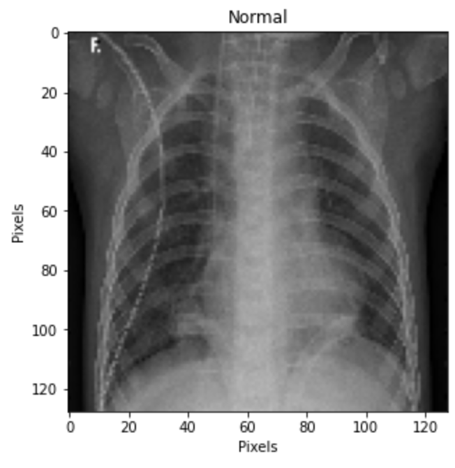
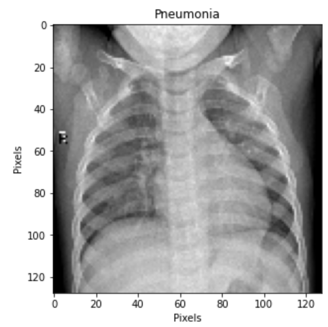
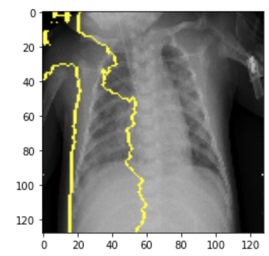

# Chest X-Ray Analysis

**Author**: [Michael Tsypin](email:mtsypin9@yahoo.com)

Date: 5/23/2024

## Overview

The main goal of this project is to create a model that can predict whether a patient has pneumonia or not based on a chest x-ray image. Using various image classification with deep learning techniques, we will analyze chest x-ray images of pediatric patients from the Guangzhou Women and Children's Medical Center. Using this dataset, we will iterate through multiple models to determine which is the most accurate.

## Business Problem

A hospital wants to reduce the amount of time spent reviewing chest x-ray images. We need to create a model that is able to read and analyze chest x-ray images to determine if a patient has pneumonia. Using the dataset from the Guangzhou Women and Children's Medical Center, this model will be effective in producing mass results and accurate readings.

## Data Understanding

The data used in this project comes from the Guangzhou Women and Children's Medical Center (Kermany et al.). The chest x-ray images comes from pediatric patients between the ages of one to five years old who underwent chest x-ray imaging as part of their routine clinical workup. The images provided are anterior-posterior views of the chest. A total of three expert physicians graded these images to confirm the diagnoses of pneumonia or not to be cleared to use for model training.

See the full dataset in [chest_x_ray](chest_x_ray) 


## Modeling

Utilizing and iterating through deep neural networks to find the most accurate model.





## Evaluation

CNN model is the best model with an accuracy score of about 76.5%




## Conclusion

The best and final model we found based on accuracy score was our Convolutional Neural Network (CNN) model. This model has an accuracy score of about 76.5%. We would recommend that the hospital use this model to feed chest x-rays so that a radiologist can use the model's prediction to help determine a diagnosis of pneumonia or not. We would also recommend that the radiologist use LIME to aid diagnosis assistance by making more accurate and quicker diagnoses using LIME outlines.

## For More Information

See the full analysis in the [Jupyter Notebook](chest_xray_analysis.ipynb) or review [Presentation](chest_xray_presentation.pdf)

## Repository Structure

```
├── chest_x_ray
├── images
├── .gitignore
├── README.md
├── chest_xray_analysis
└── chest_xray_presentation
```
